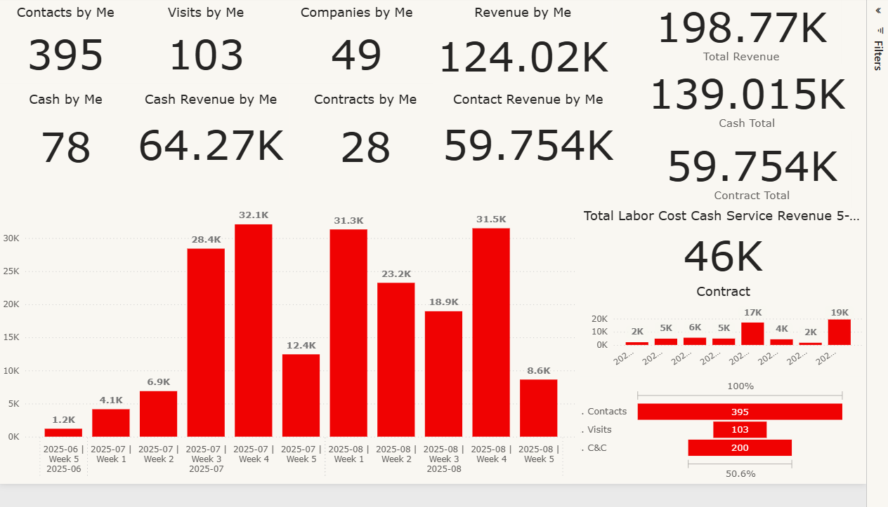
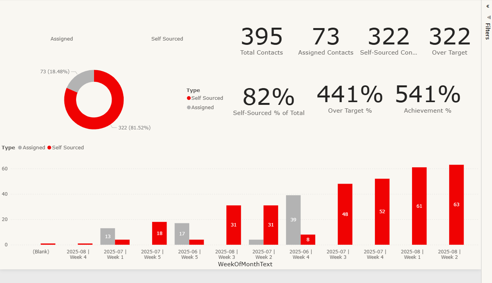
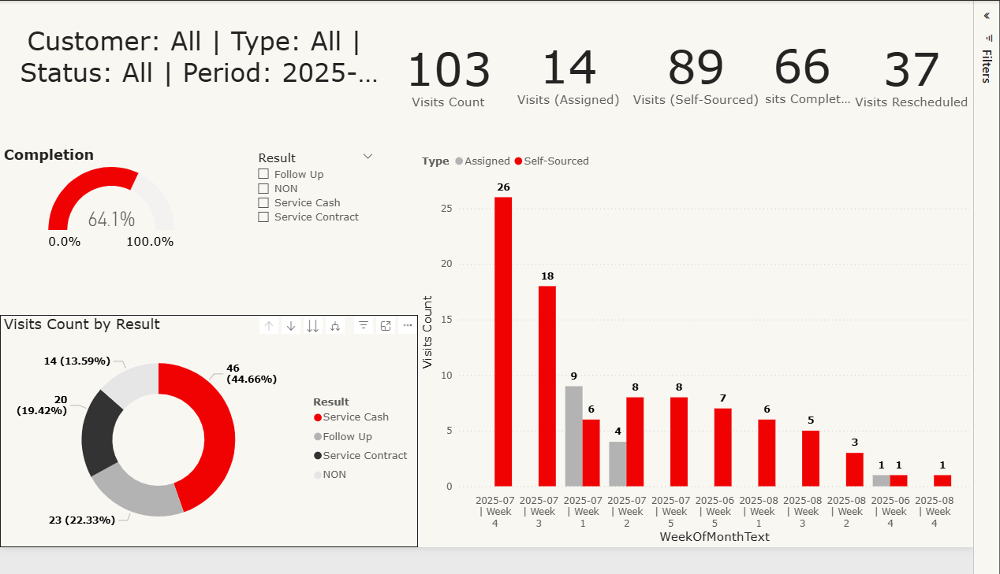
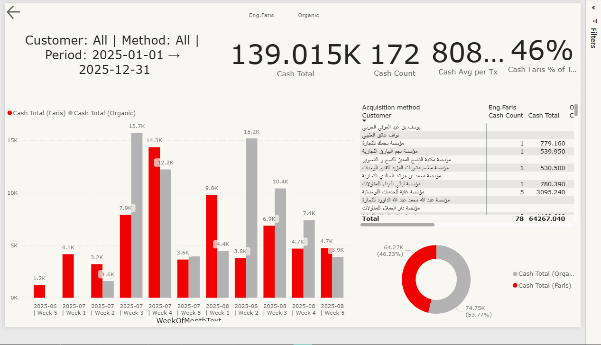
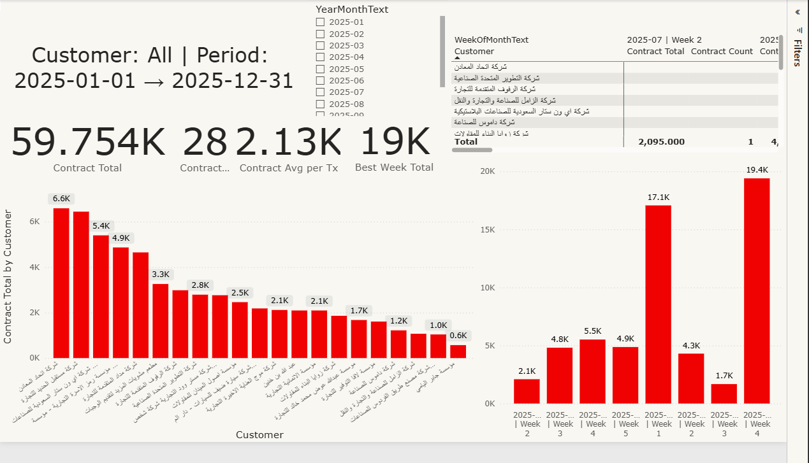

# eng.faris report

**Description:**  
Complete Power BI report for Eng. Faris, including data analysis, client visits tracking, and service performance.  
The report covers visits, service types, and funnel stages, including conversion rates and engineer-led acquisition metrics.

**Dashboard Pages & Highlights:**  
- **Overall:** Summary of sales and visits performance  
- **Contact List:** Details of clients and contacts  
- **Visits:** Track all client/branch visits  
- **Service by Cash:** Analysis of cash-based services  
- **Service by Contract:** Analysis of contract-based services  
- **Funnel & Conversion:** Visualize visit-to-client conversion stages  
- **Engineer Acquisition Rate:** Percentage of clients acquired directly by the engineer  
- **Natural Metrics:** Other performance indicators and analytics

**Data Cleaning in Power BI / Excel:**  
- Removed duplicates & unnecessary columns  
- Standardized column names  
- Converted dates & numeric formats

**Dashboard:**  
Interactive Power BI dashboard included: `dashboard.pbix`

**Tools Used:**  
Power BI Desktop, Excel

**Screenshots:**  

